# 智慧后厨备菜与点单系统

面向餐厅点单、厨房出餐、库存管理和 AI 客服的一体化项目。顾客通过微信小程序点单、支付、加菜和评价；厨房通过看板接单出餐；管理端负责菜品、订单、库存和知识库管理；AI 服务提供菜品推荐、实时库存与配料查询，以及备菜预测能力。

## 项目亮点

- 先付后做：订单支付成功后才进入厨房看板。
- 加菜闭环：新增菜品创建子订单，补付成功后再推送厨房制作。
- 用餐状态闭环：出餐后仍可加菜，全部菜品已付款且已出餐时可结束用餐并评价。
- 实时库存：库存查询与下单共享 Redis 库存口径，异常时自动回源 MySQL。
- AI 客服：支持菜品推荐、库存、配料与过敏原查询；多菜或“库存 + 配料”问题使用批量实时查询。

## 架构

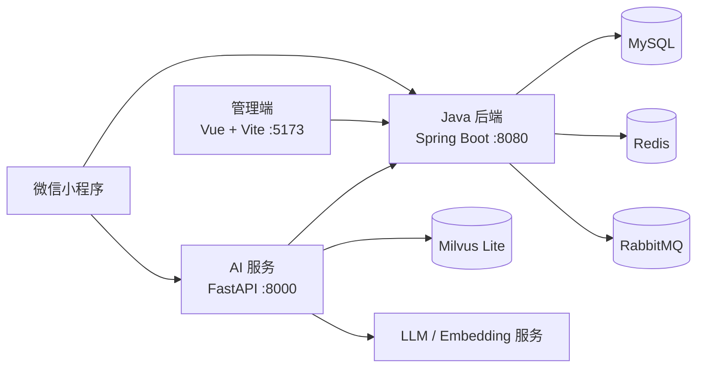

## 目录说明

| 目录 | 说明 |
| --- | --- |
| `smart-kitchen/` | Java 后端、订单与厨房业务、管理接口 |
| `smart-kitchen-ai/` | FastAPI AI 客服、RAG、备菜预测 |
| `admin-web/` | Vue 管理端 |
| `miniprogram/` | 微信小程序 |
| `queries/` | 数据库升级脚本 |
| `docs/` | 环境、数据库、Gitee Go 和协作说明 |

## 快速开始

详细步骤见 [本地启动与数据库说明](docs/SETUP.md)。

```bash
cd smart-kitchen && mvn spring-boot:run
cd smart-kitchen-ai && .venv/bin/uvicorn app.main:app --host 0.0.0.0 --port 8000
cd admin-web && npm run dev -- --host 0.0.0.0
```

| 服务 | 地址 |
| --- | --- |
| Java API | `http://localhost:8080` |
| AI API | `http://localhost:8000` |
| 管理端 | `http://localhost:5173` |
| 微信小程序 | 使用微信开发者工具导入 `miniprogram/` |

## 数据库升级

首次初始化请执行 `smart-kitchen/src/main/resources/db/schema.sql`。已有数据库升级 AI 知识库文档表时，依次执行 [Query_3.sql](queries/Query_3.sql) 与 [Query_4.sql](queries/Query_4.sql)。更多说明见 [数据库迁移](docs/SETUP.md#数据库初始化与升级)。

## 验证

```bash
cd smart-kitchen && mvn test
cd smart-kitchen-ai && .venv/bin/python -m pytest tests/test_dish_tools_auth.py -q
python3 tests/test_miniprogram.py
```

## 小程序点餐与用餐闭环

### 1. 微信小程序点单

按分类浏览菜品、查看库存状态，并将菜品加入购物车后提交订单。

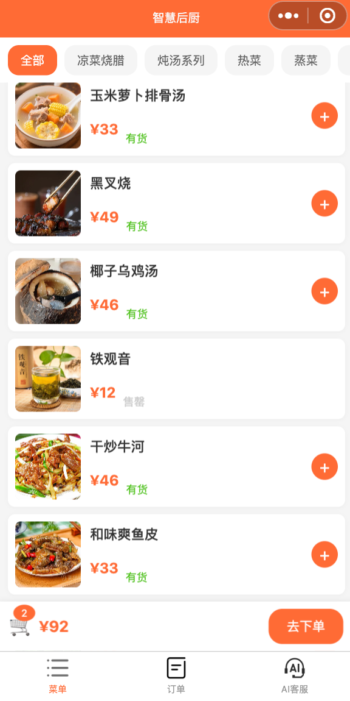

### 2. 支付页面

订单创建后显示 15 分钟支付倒计时，超时未支付将自动取消。

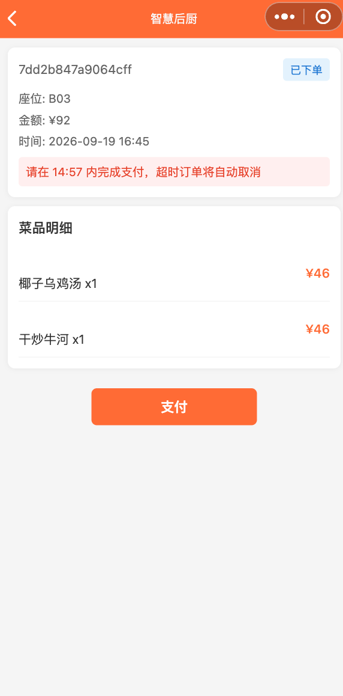

### 3. 订单详情

支付后可查看菜品明细，并在用餐期间进入加菜流程。

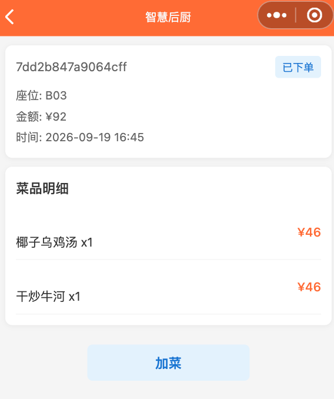

### 4. 加菜确认

从订单详情进入点单页，确认座位号后提交加菜；加菜金额需补付后才推送厨房。

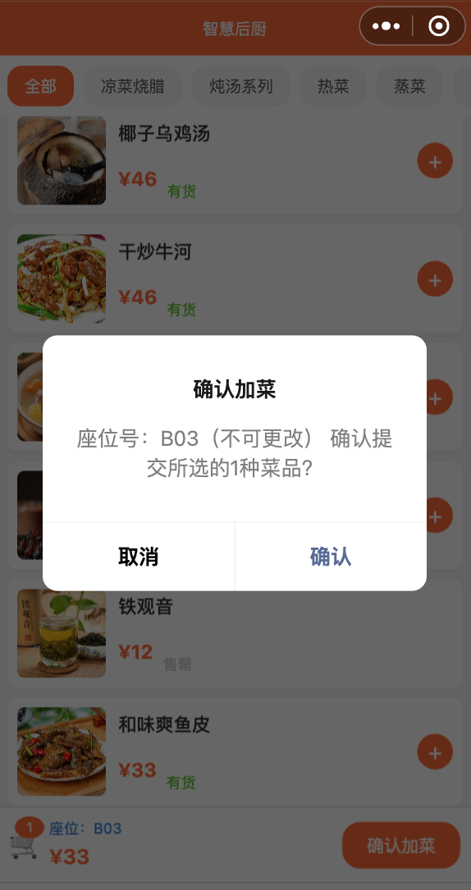

### 5. 厨房出餐后

全部菜品完成出餐后，订单显示“已上菜”，顾客可继续加菜或结束用餐。

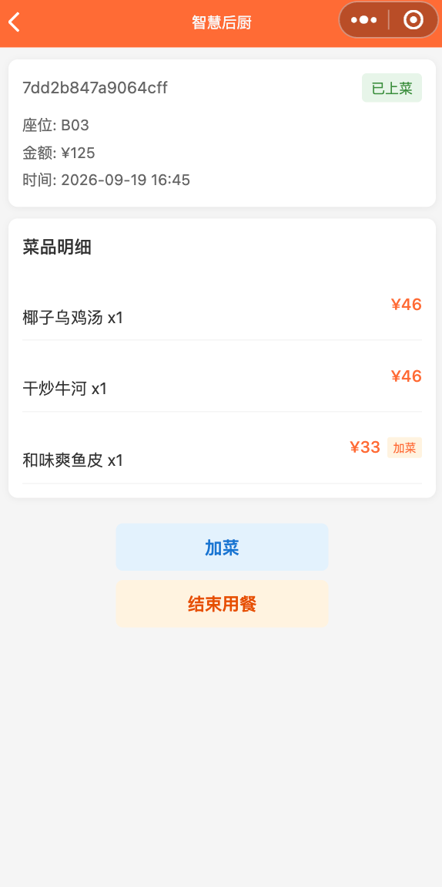

### 6. AI 客服

支持基于知识库推荐菜品，并结合实时配料、过敏原等信息提供饮食提示。

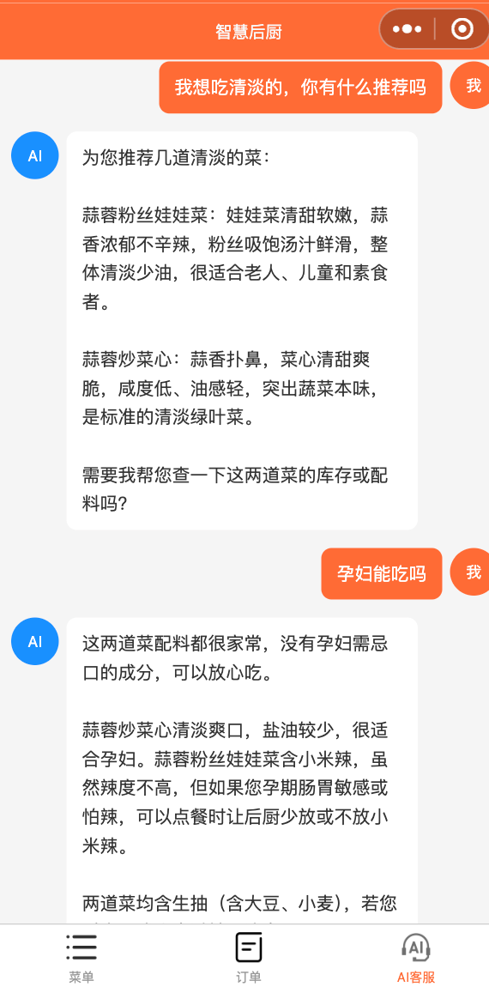

## 管理端界面展示

### 1. 管理端首页

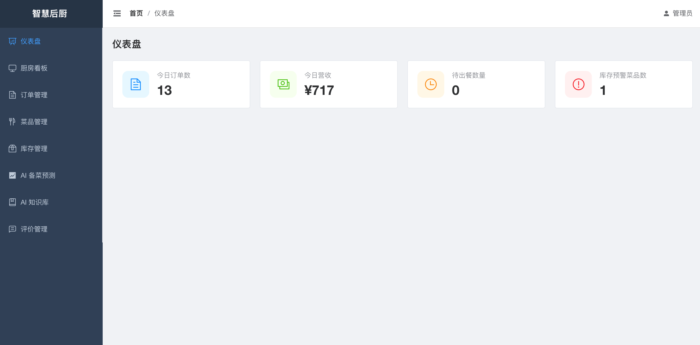

### 2. 厨房看板

实时接收已支付订单，并支持完成出餐。

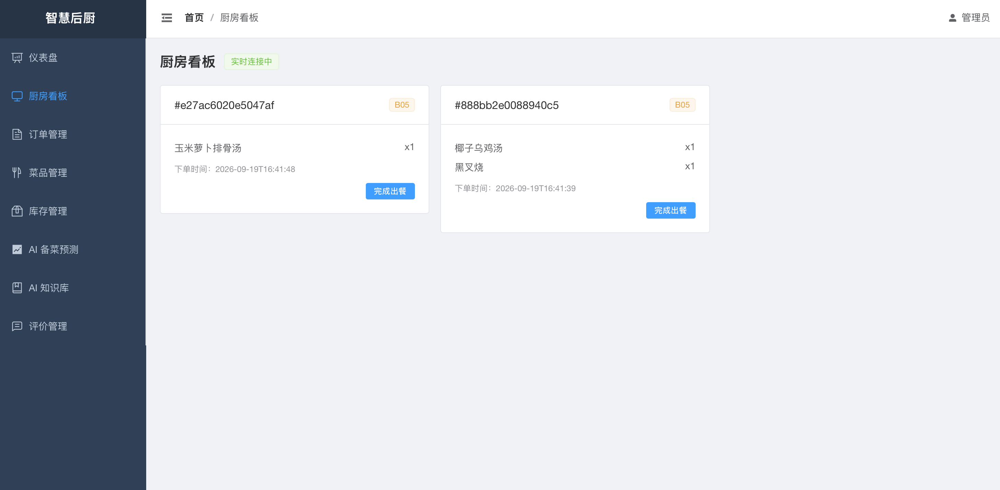

### 3. 订单管理

支持按订单状态和座位号筛选，查看订单详情、撤销订单和完成出餐。

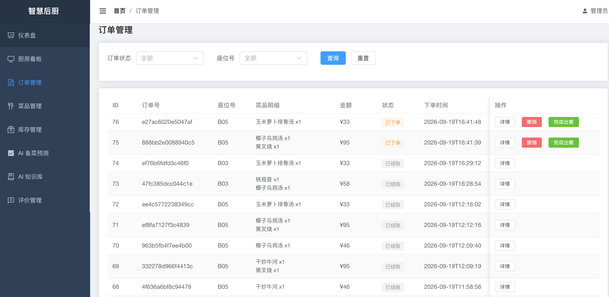

### 4. 菜品管理

维护菜品分类、价格、库存、配料、过敏原和上下架状态。

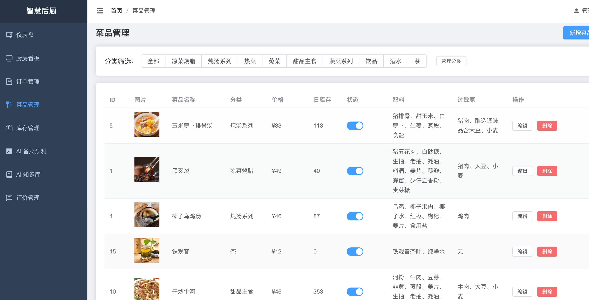

### 5. 库存管理

展示库存预警状态，并支持人工调整库存。

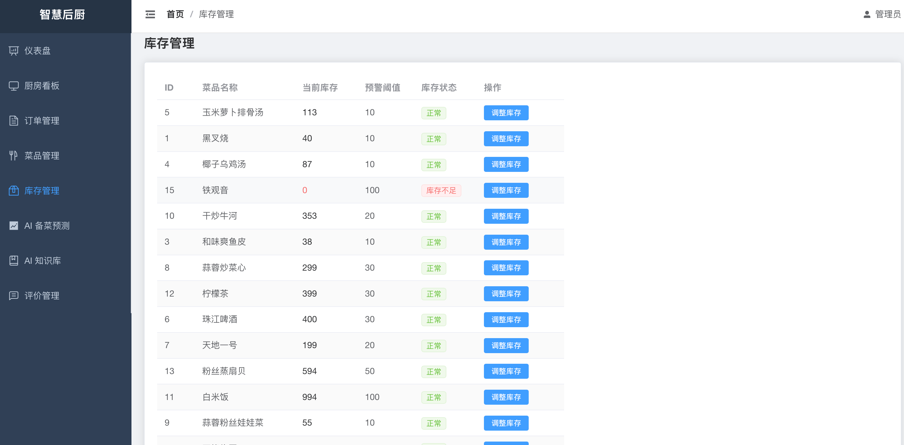

### 6. AI 备菜预测

基于历史数据给出备菜建议量、置信度和推理说明，管理员可确认覆盖。

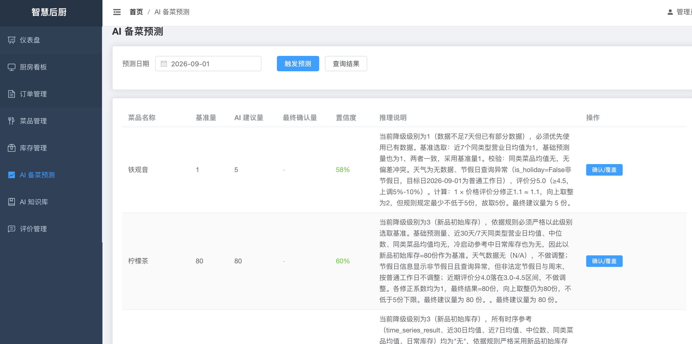

### 7. AI 知识库

支持上传、查看、编辑和归档知识文档，为客服 AI 提供检索依据。

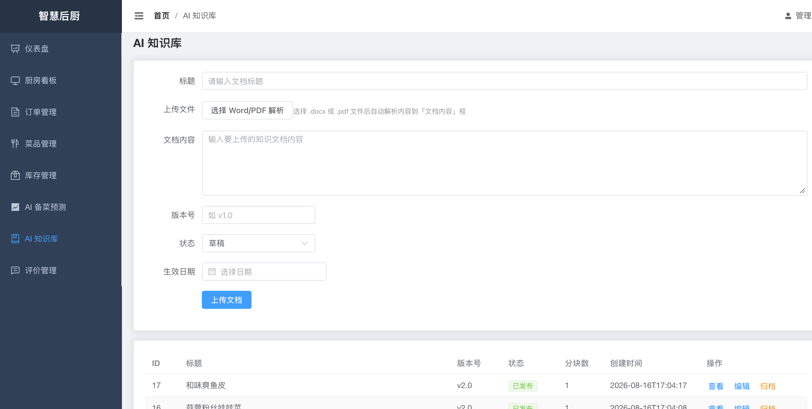

### 8. 评价管理

集中查看订单评分与评价内容，完整展示五级评分。

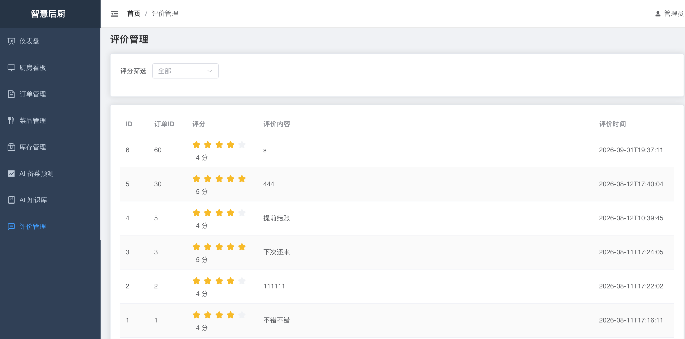

## 贡献与许可证

- 协作约定见 [CONTRIBUTING.md](CONTRIBUTING.md)。
- Gitee Go 校验步骤见 [docs/GITEE_GO.md](docs/GITEE_GO.md)。
- 本项目以 [MIT License](LICENSE) 发布。
