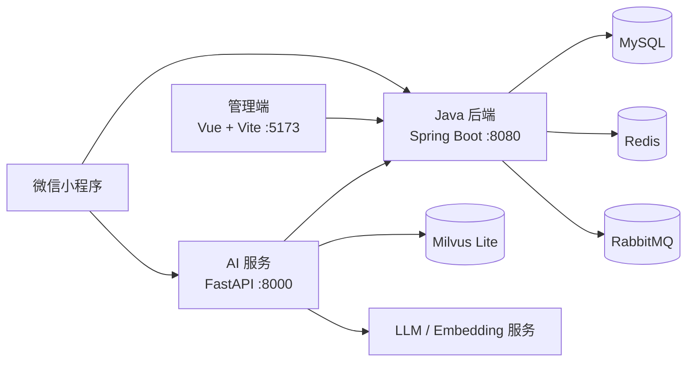

# 智慧后厨备菜与点单系统

面向餐厅点单、厨房出餐、库存管理和 AI 客服的一体化项目。顾客通过微信小程序点单、支付、加菜和评价；厨房通过看板接单出餐；管理端负责菜品、订单、库存和知识库管理；AI 服务提供菜品推荐、实时库存与配料查询，以及备菜预测能力。

## 项目亮点

- 先付后做：订单支付成功后才进入厨房看板。
- 加菜闭环：新增菜品创建子订单，补付成功后再推送厨房制作。
- 用餐状态闭环：出餐后仍可加菜，全部菜品已付款且已出餐时可结束用餐并评价。
- 实时库存：库存查询与下单共享 Redis 库存口径，异常时自动回源 MySQL。
- AI 客服：支持菜品推荐、库存、配料与过敏原查询；多菜或“库存 + 配料”问题使用批量实时查询。

## 架构



## 目录说明

| 目录 | 说明 |
| --- | --- |
| `smart-kitchen/` | Java 后端、订单与厨房业务、管理接口 |
| `smart-kitchen-ai/` | FastAPI AI 客服、RAG、备菜预测 |
| `admin-web/` | Vue 管理端 |
| `miniprogram/` | 微信小程序 |
| `queries/` | 数据库升级脚本 |
| `docs/` | 环境、数据库、Gitee Go 和协作说明 |

## 快速开始

详细步骤见 [本地启动与数据库说明](docs/SETUP.md)。

```bash
cd smart-kitchen && mvn spring-boot:run
cd smart-kitchen-ai && .venv/bin/uvicorn app.main:app --host 0.0.0.0 --port 8000
cd admin-web && npm run dev -- --host 0.0.0.0
```

| 服务 | 地址 |
| --- | --- |
| Java API | `http://localhost:8080` |
| AI API | `http://localhost:8000` |
| 管理端 | `http://localhost:5173` |
| 微信小程序 | 使用微信开发者工具导入 `miniprogram/` |

## 数据库升级

首次初始化请执行 `smart-kitchen/src/main/resources/db/schema.sql`。已有数据库升级 AI 知识库文档表时，执行 [Query_3.sql](queries/Query_3.sql)。更多说明见 [数据库迁移](docs/SETUP.md#数据库初始化与升级)。

## 验证

```bash
cd smart-kitchen && mvn test
cd smart-kitchen-ai && .venv/bin/python -m pytest tests/test_dish_tools_auth.py -q
python3 tests/test_miniprogram.py
```

## 演示截图（待补充）

> 请将截图放入 `docs/images/`，再替换以下链接。截图不得包含真实手机号、Token、密钥或顾客隐私信息。

| 场景 | 建议文件名 | 说明 |
| --- | --- | --- |
| 小程序点单与购物车 | `docs/images/miniprogram-order.png` | 展示选菜和提交订单 |
| 加菜与结束用餐 | `docs/images/miniprogram-add-dish.png` | 展示加菜补付及“结束用餐”按钮 |
| 厨房看板 | `docs/images/kitchen-board.png` | 展示待制作订单和完成出餐 |
| 管理端仪表盘 | `docs/images/admin-dashboard.png` | 展示订单、库存预警等核心数据 |
| AI 客服批量查询 | `docs/images/ai-batch-query.png` | 展示两道菜库存、配料和过敏原的一次性回答 |

## 贡献与许可证

- 协作约定见 [CONTRIBUTING.md](CONTRIBUTING.md)。
- Gitee Go 校验步骤见 [docs/GITEE_GO.md](docs/GITEE_GO.md)。
- 本项目以 [MIT License](LICENSE) 发布。
