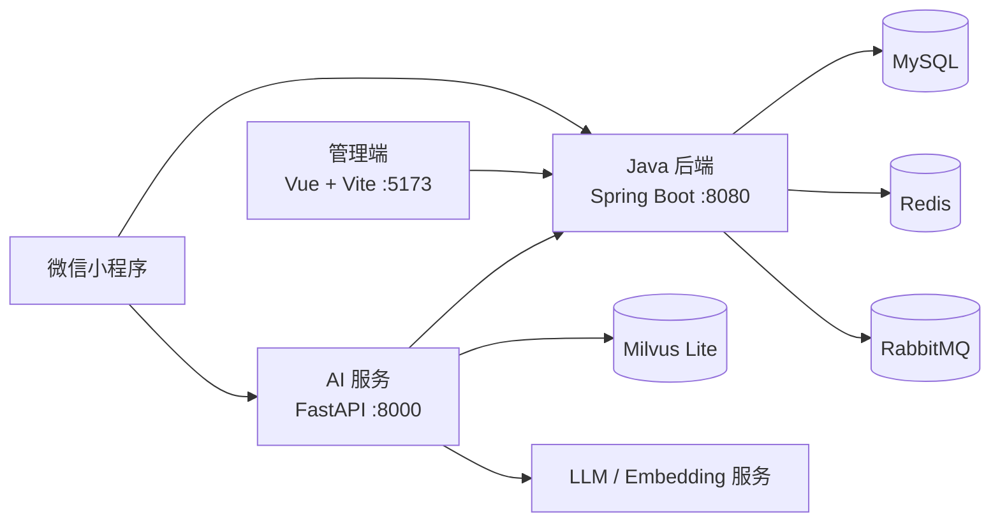

# 智慧后厨备菜与点单系统

面向餐厅点单、厨房出餐、库存管理和 AI 客服的一体化项目。顾客通过微信小程序点单、支付、加菜和评价；厨房通过看板接单出餐；管理端负责菜品、订单、库存和知识库管理；AI 服务提供菜品推荐、实时库存与配料查询，以及备菜预测能力。

## 项目亮点

- 先付后做：订单支付成功后才进入厨房看板。
- 加菜闭环：新增菜品创建子订单，补付成功后再推送厨房制作。
- 用餐状态闭环：出餐后仍可加菜，全部菜品已付款且已出餐时可结束用餐并评价。
- 实时库存：库存查询与下单共享 Redis 库存口径，异常时自动回源 MySQL。
- AI 客服：支持菜品推荐、库存、配料与过敏原查询；多菜或“库存 + 配料”问题使用批量实时查询。

## 架构



## 目录说明

| 目录 | 说明 |
| --- | --- |
| `smart-kitchen/` | Java 后端、订单与厨房业务、管理接口 |
| `smart-kitchen-ai/` | FastAPI AI 客服、RAG、备菜预测 |
| `admin-web/` | Vue 管理端 |
| `miniprogram/` | 微信小程序 |
| `queries/` | 数据库升级脚本 |
| `docs/` | 环境、数据库、Gitee Go 和协作说明 |

## 快速开始

详细步骤见 [本地启动与数据库说明](docs/SETUP.md)。

```bash
cd smart-kitchen && mvn spring-boot:run
cd smart-kitchen-ai && .venv/bin/uvicorn app.main:app --host 0.0.0.0 --port 8000
cd admin-web && npm run dev -- --host 0.0.0.0
```

| 服务 | 地址 |
| --- | --- |
| Java API | `http://localhost:8080` |
| AI API | `http://localhost:8000` |
| 管理端 | `http://localhost:5173` |
| 微信小程序 | 使用微信开发者工具导入 `miniprogram/` |

## 数据库升级

首次初始化请执行 `smart-kitchen/src/main/resources/db/schema.sql`。已有数据库升级 AI 知识库文档表时，依次执行 [Query_3.sql](queries/Query_3.sql) 与 [Query_4.sql](queries/Query_4.sql)。更多说明见 [数据库迁移](docs/SETUP.md#数据库初始化与升级)。

## 验证

```bash
cd smart-kitchen && mvn test
cd smart-kitchen-ai && .venv/bin/python -m pytest tests/test_dish_tools_auth.py -q
python3 tests/test_miniprogram.py
```

## 小程序点餐与用餐闭环

顾客可在小程序内完成选菜、支付、加菜、结束用餐，并通过 AI 客服获取菜品推荐和饮食提示。

### 点餐与支付

<p align="center">
  
  
  
</p>

<p align="center"><sub>① 分类浏览与购物车下单　　② 15 分钟支付倒计时　　③ 支付后的订单明细</sub></p>

- 顾客可按分类浏览菜品，实时看到“有货 / 售罄”状态。
- 订单创建后进入支付页，未支付订单将在 15 分钟后自动取消。
- 支付成功后可查看订单明细，并在用餐期间发起加菜。

### 加菜、出餐与结束用餐

<p align="center">
  
  
  
</p>

<p align="center"><sub>④ 确认座位号后提交加菜　　⑤ 厨房出餐后继续加菜或结束用餐　　⑥ AI 客服饮食咨询</sub></p>

- 加菜会生成子订单，补付成功后才会同步到厨房制作。
- 全部菜品出餐后，订单显示“已上菜”，顾客可以继续加菜或结束用餐并评价。
- AI 客服支持知识库菜品推荐，并结合实时配料、过敏原提供饮食提示。

## 管理端界面展示

管理端覆盖经营总览、厨房协作、订单、菜品、库存、AI 预测、知识库与评价管理。

### 经营总览与厨房协作

<p align="center">
  
  
</p>

<p align="center"><sub>仪表盘：今日订单、营收、待出餐及库存预警　　厨房看板：实时接收订单并完成出餐</sub></p>

### 订单与菜品管理

<p align="center">
  
  
</p>

<p align="center"><sub>订单管理：筛选、详情、撤销与出餐操作　　菜品管理：分类、价格、库存、配料与过敏原</sub></p>

### 库存与 AI 备菜预测

<p align="center">
  
  
</p>

<p align="center"><sub>库存管理：库存预警与人工调整　　AI 备菜预测：建议量、置信度、推理说明与人工确认</sub></p>

### AI 知识库与评价管理

<p align="center">
  
  
</p>

<p align="center"><sub>AI 知识库：上传、查看、编辑与归档知识文档　　评价管理：完整展示五级评分和评价内容</sub></p>

## 贡献与许可证

- 协作约定见 [CONTRIBUTING.md](CONTRIBUTING.md)。
- Gitee Go 校验步骤见 [docs/GITEE_GO.md](docs/GITEE_GO.md)。
- 本项目以 [MIT License](LICENSE) 发布。
