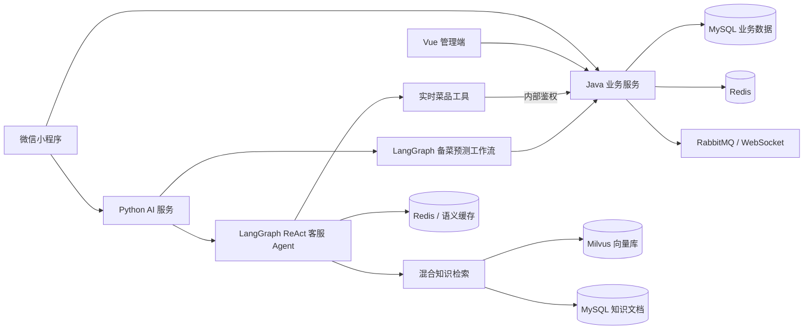
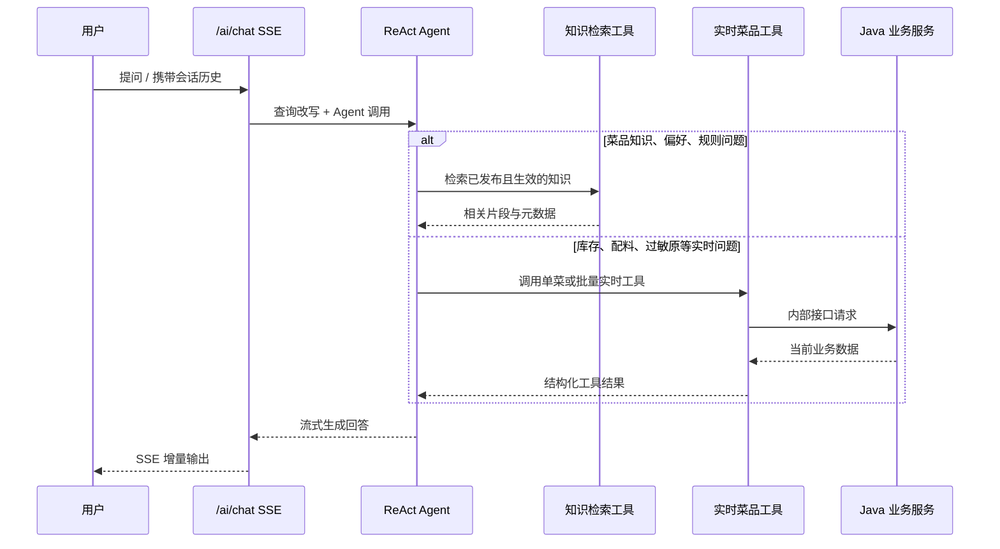
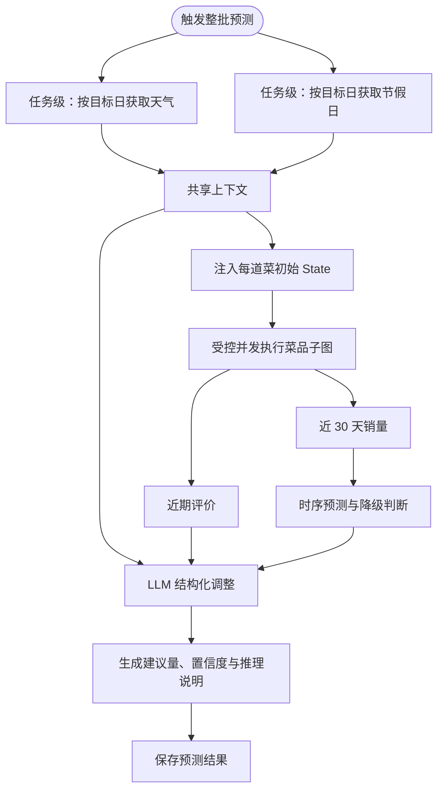

# 智慧后厨 Agent 应用平台

> 面向餐饮场景的 Agent 应用项目：将**可检索的运营知识**、**必须实时获取的业务数据**与**可落地执行的预测工作流**拆分处理，形成可追溯、可评测的智能客服与备菜决策能力。

这是一个全栈智慧餐饮项目，但 README 聚焦于 Agent 应用开发岗位最需要展示的部分：Agent 如何使用工具、RAG 如何接入业务知识、工作流如何编排，以及如何保证响应可靠与数据不过期。

## 目录

- [项目定位](#项目定位)
- [Agent 应用亮点](#agent-应用亮点)
- [系统架构](#系统架构)
- [核心 Agent 工作流](#核心-agent-工作流)
- [关键工程设计](#关键工程设计)
- [技术栈](#技术栈)
- [核心代码索引](#核心代码索引)
- [快速开始](#快速开始)
- [验证与评测](#验证与评测)
- [项目结构](#项目结构)
- [界面展示](#界面展示)

## 项目定位

餐饮客服类问题不能只靠一次向量检索回答：例如“这道菜辣不辣”适合从知识库找答案，而“这两道菜现在有没有库存、配料是什么”必须访问最新业务数据。本项目将两类信息源显式分开：

- **静态/运营知识**：菜品介绍、口味、过敏原、服务规则等，通过版本化知识库进入 RAG 检索链路。
- **实时业务数据**：库存、配料、菜品状态，通过 Agent 工具调用 Java 业务服务获取，避免模型依据旧上下文臆测。
- **决策型任务**：备菜预测由 LangGraph StateGraph 编排数据收集、时序推断、LLM 调整与保存，不把业务流程写成不可观测的单段提示词。

## Agent 应用亮点

### 1. ReAct 客服 Agent：检索与工具调用按问题路由

客服 Agent 基于 LangGraph 的 `create_react_agent` 构建，模型会根据问题选择知识检索或实时工具，而不是把所有数据预先塞进上下文。

- 支持菜品偏好检索、单菜库存、单菜配料，以及一次查询多道菜实时信息。
- 批量工具一次接收最多 10 个菜名，合并返回库存、配料和过敏原，避免“查两个菜”时触发多次独立调用。
- 工具结果由后端生成，模型只负责理解意图、调用工具和组织回答；实时字段不由模型自行推断。
- 对话通过 SSE 流式输出，支持取消生成与客户端断连清理。


### 2. 版本化 RAG：把知识库做成可运营的数据源

管理端支持上传或编辑知识文档，文档以标题、版本、状态、生效日期、分块数等元数据管理。检索时只使用已发布且已生效的内容，并通过“Dense 向量召回 + BM25 稀疏召回 → RRF 融合”兼顾语义表达与菜名等实体查询。

- 文档采用分块、重叠切分后写入 Milvus；Dense 与 BM25 使用同一可见性过滤，避免草稿/归档内容进入任一召回分支。
- 可选接入兼容 `query + documents + top_n` 协议的云端 Reranker；未配置、超时或调用失败时，严格回退至 RRF 融合结果。
- 知识库版本指纹参与语义缓存键：知识变更后，旧答案不会继续命中为当前知识答案。
- 将外部/知识库内容包裹为非指令数据，降低间接提示注入影响模型行为的风险。


### 3. LangGraph 预测工作流：任务级共享上下文，结构化输出决策

备菜预测不是单轮聊天。任务启动时，天气和节假日按目标日期各拉取一次，再注入每道菜的初始 `State`；子图中的对应节点发现已有值会短路，不会对每道菜重复访问外部服务。随后各菜品预测在受控并发下执行销量、评价、时序推断和 LLM 结构化调整，最终保存可供管理端确认/覆盖的结果。

- 天气、节假日是任务级共享信号：按日期只请求一次，复用至整批菜品的 State，降低外部 API 调用次数。
- 每道菜的子图仍独立计算近 30 天销量、近期评价与时序基准；整批菜品通过共享信号量控制并发，保护 LLM 与外部依赖。
- 使用 Pydantic 约束 LLM 输出为结构化预测调整，而非依赖自由文本解析。
- 在数据不足、天气缺失或规则冲突时保留降级说明，便于追溯建议的依据和置信度。


### 4. 多轮理解与语义缓存：兼顾体验、成本与正确性

- 查询改写采用“规则优先、LLM 兜底”：可将“它辣吗”结合上一轮菜名改写为完整问题。
- Milvus 语义缓存以相似度阈值复用稳定问答，缓存不可用时自动退化为正常推理，不影响主链路。
- 库存、配料等需要最新状态的问题由业务工具提供事实来源；知识问答与实时查询各自使用合适的数据路径。

## 系统架构



数据职责按“谁最接近事实”划分：Java 服务负责订单、库存与菜品事实；Python 服务负责 Agent 编排、模型调用、RAG 和预测；管理端和小程序提供两类业务入口。

## 核心 Agent 工作流

### 客服问答链路



客服工具边界：

- **`search_dish_by_preference`**：处理口味、饮食偏好、菜品推荐等知识型问题。
- **`check_dish_inventory`**：查询某一道菜当前库存。
- **`get_dish_ingredients`**：查询某一道菜的配料及过敏原提示。
- **`get_dishes_realtime_info`**：一次查询多道菜的库存、配料和过敏原，降低多工具往返。

### 备菜预测链路



## 关键工程设计

### 事实与生成分离

项目不要求大模型“记住”库存或配料。模型通过工具编排获得事实，生成层只负责解释与交互。这能降低幻觉风险，也使事实数据变动无需重建向量库。

### 缓存随知识版本失效

语义缓存除了问题向量，还绑定知识库版本指纹。知识文档发布、归档或升级后，旧缓存自然不再与当前知识版本匹配；缓存异常时回退模型/检索主链路。

### 检索链路可渐进增强

```text
Dense Top N + BM25 Top N → RRF 融合 → 可选云端 Reranker → Top K → LLM
                                     └── 未配置 / 超时 / 失败 → RRF Top K
```

Reranker 不是运行前置条件。默认配置不携带 URL 和 API Key，不会发出任何云端请求；因此本地联调可直接使用 RRF 结果，获得可用密钥后仅通过环境变量开启重排。

### 可观测、可验证的 AI 输出

- 预测结果带有置信度、降级级别和推理说明，运营人员可确认或覆盖建议。
- 预置 RAG 与语义缓存评测集，支持将典型问题沉淀为可重复验证的样例。
- 覆盖聊天鉴权、多轮会话、工具鉴权、知识清理、预测与缓存等自动化测试。

### 面向生产问题的防护

- AI 接口使用 JWT 校验、会话归属校验与限流；Redis Lua 滑动窗口负责多实例共享限流，Redis 不可用时降级为单进程内存滑动窗口。
- Java 内部代理接口可启用独立内部令牌，限制 AI 服务访问实时业务数据的边界。
- HTTP 工具调用设置连接与总超时，异常返回可解释的失败信息，避免卡死整个 Agent 回答。

## 技术栈

- **Agent / LLM**：LangGraph、LangChain、OpenAI 兼容模型接口、Pydantic Structured Output。
- **RAG / 数据**：Milvus、向量检索、Redis 语义缓存、MySQL 版本化文档元数据。
- **AI 服务**：FastAPI、SSE、httpx、pytest。
- **业务服务**：Spring Boot 3、MyBatis-Plus、MySQL、Redis、RabbitMQ、WebSocket。
- **客户端**：Vue 3 + Vite 管理端、微信小程序。

## 核心代码索引

- [ReAct 客服 Agent](smart-kitchen-ai/app/agents/cs_agent.py)：工具注册、模型配置与 Agent 创建。
- [备菜预测 StateGraph](smart-kitchen-ai/app/agents/predict_agent.py)：复用任务级天气/节假日 State、时序预测与结构化调整。
- [预测任务编排](smart-kitchen-ai/app/services/predict_service.py)：一次拉取共享上下文并注入各菜品 State，控制整批并发。
- [实时菜品工具](smart-kitchen-ai/app/tools/dish_tools.py)：库存/配料/批量实时信息工具与超时处理。
- [RAG 服务](smart-kitchen-ai/app/services/rag_service.py)：文档分块、Dense + BM25 粗召回、RRF 融合与知识状态过滤。
- [云端 Reranker 适配层](smart-kitchen-ai/app/services/reranker_service.py)：可配置 HTTP 重排与无损 RRF 降级。
- [查询改写](smart-kitchen-ai/app/services/query_rewrite.py)：规则优先的多轮指代消解与 LLM 兜底。
- [语义缓存](smart-kitchen-ai/app/services/semantic_cache_service.py)：相似问题命中、知识版本指纹与降级处理。
- [流式聊天接口](smart-kitchen-ai/app/api/chat.py)：SSE、取消生成、断连处理、鉴权入口。
- [Java 实时数据代理](smart-kitchen/src/main/java/com/smartkitchen/controller/DishProxyController.java)：给 AI 工具提供受控的菜品实时数据接口。

## 快速开始

### 1. 准备基础服务

启动 MySQL、Redis、RabbitMQ 与 Milvus，并按项目配置创建数据库。SQL 初始化及补丁位于 [queries](queries) 目录。

```bash
mysql -u root -p < queries/Query_4.sql
```

### 2. 启动 Java 业务服务

```bash
cd smart-kitchen
mvn spring-boot:run
```

### 3. 启动 Python AI 服务

```bash
cd smart-kitchen-ai
python3 -m venv .venv
source .venv/bin/activate
pip install -r requirements.txt
uvicorn app.main:app --reload --port 8000
```

### 4. 启动管理端

```bash
cd admin-web
npm install
npm run dev
```

小程序可使用微信开发者工具打开 [miniprogram](miniprogram) 目录。首次运行前，请按各服务的 `.env.example` 或配置文件填写数据库、Redis、向量库、模型接口和内部服务令牌。

## 验证与评测

以下命令覆盖业务服务、AI 服务及小程序相关检查；请在完成依赖配置后执行：

```bash
cd smart-kitchen && mvn test
cd ../smart-kitchen-ai && .venv/bin/python -m pytest tests -q
cd .. && python3 tests/test_miniprogram.py
python3 tests/test_stock_concurrency.py
cd smart-kitchen-ai && .venv/bin/python eval/run_eval.py
```

评测样例位于 [smart-kitchen-ai/eval](smart-kitchen-ai/eval)，包含语义偏好、精确菜名实体与低相关问题。RAG 评测输出 Recall@3、MRR 与低相关空结果率，适合作为调整召回参数、启用 Reranker 前后的回归检查入口。

## 项目结构

```text
TODO-demo/
├── smart-kitchen/                 # Java 业务服务：订单、库存、菜品、内部代理
├── smart-kitchen-ai/              # Python AI 服务：Agent、RAG、缓存、预测、评测
│   ├── app/agents/                # ReAct 客服 Agent 与预测 StateGraph
│   ├── app/tools/                 # Agent 可调用的业务工具
│   ├── app/services/              # RAG、缓存、查询改写、LLM 服务
│   ├── tests/                     # AI 链路自动化测试
│   └── eval/                      # RAG / 缓存评测样例
├── admin-web/                     # Vue 管理端
├── miniprogram/                   # 微信小程序
├── queries/                       # 数据库初始化与升级脚本
└── docs/images/                   # README 界面截图
```

## 界面展示

### 小程序：点单到出餐的业务闭环

<p align="center">
  
  
  
</p>
<p align="center">点单、支付倒计时与加菜确认。订单状态贯穿小程序、厨房看板与管理端。</p>

<p align="center">
  
  
  
</p>
<p align="center">订单详情会随状态更新；AI 客服提供推荐、配料与饮食问题咨询。</p>

### 管理端：Agent 可落地的业务入口

<p align="center">
  
  
</p>
<p align="center">知识库运营与备菜预测结果，是 Agent 能力进入日常业务流程的两个管理入口。</p>

<details>
<summary>展开查看其余业务管理界面</summary>

<p align="center">
  
  
</p>
<p align="center">
  
  
</p>
<p align="center">
  
  
</p>
</details>

## 说明

本项目的亮点是**一个 ReAct 客服 Agent**与**一个 LangGraph 预测工作流**，并非为了包装而宣称多 Agent 系统。后续可在现有工具边界上继续演进，例如增加订单查询、预约排队等专用工具，并以评测集约束每次能力扩展的质量。
